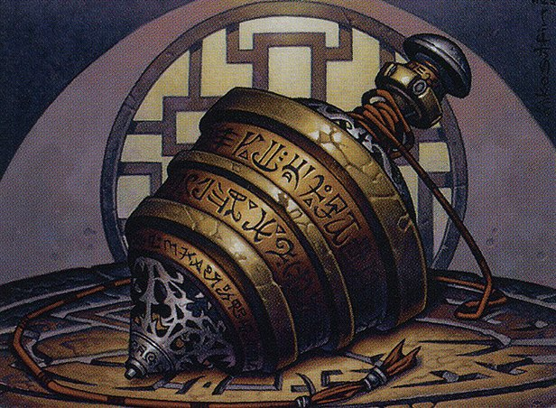

## 010: Reviewing the Artifacts of Champions of Kamigawa for cube

## Show Notes

## Featured on Today's Episode

* General's Kabuto - 02:17
* Hair-Strung Koto - 08:22
* Hankyu - 14:00
* Honor-Worn Shaku - 17:18
* Imi Statue - 23:24
* Jade Idol - 28:09
* Journeyer's Kite - 32:39
* Junkyo Bell - 36:40
* Konda's Banner - 41:20
* Kusari-Gama - 45:46
* Long-Forgotten Gohei - 52:59
* Moonring Mirror - 55:41
* Nine-Ringed Bo - 58:26
* No-Dachi - 1:03:38
* Oathkeeper, Takeno's Daisho - 1:07:26
* Orochi Hatchery - 1:11:17
* Reito Lantern - 1:19:39
* Sensei's Divining Top - 1:22:25
* Shell of the Last Kappa - 1:30:21
* Tatsumasa, the Dragon's Fang - 1:35:51
* Tenza, Godo's Maul - 1:39:21
* Uba Mask - 1:44:36

_Image credit: Sensei's Divining Top by Michael Sutfin, © Wizards of the Coast_