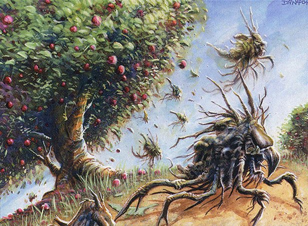

## 011: Reviewing the Lands of CHK for cube -- with bonus mana base talk!

It's hard to believe, but today's episode of Clock Spinning wraps up our discussion of Champions of Kamigawa! In this special **double feature** we'll be ending our journey through this weird and wonderful set with non-basic lands, but we're making up for it with a special (and long-promised) segment to discuss the mana base we plan to use for our [Kamigawa Block Cube](https://cubecobra.com/cube/overview/clock-spinning-chk), at least to start out.

(Spoiler: We're not only using Kamigawa lands.)

With today's episode, we've at last rated every single card in Champions of Kamigawa according to our IMPAB rating system, which stands for:

 - Insta-cut
 - Meh
 - Playable
 - Auto-include
 - Build-around

If you're just now discovering the show, we'd encourage you to start from the top with [Episode 1](https://clockspinning.com/episode-1-white-champions-of-kamigawa/), where we reviewed every white card in the set. We've been having a great time going through these cards, and would love to have you join us as we continue exploring Magic's history!

You can check out our [Kamigawa Block Cube](https://cubecobra.com/cube/overview/clock-spinning-chk) over on Cube Cobra, which we update with our card ratings and cuts after each episode. You can also try [playtesting it](https://cubecobra.com/cube/playtest/clock-spinning-chk), which should hopefully be a bit more of a gratifying experience now that we've rated every card!

If you have any thoughts to share about today's episode, the cube, or Kamigawa in general, you can reach us by email at clock[dot]spinning[dot]podcast[at]gmail[dot].com, or find us over on the [MagicTCG](https://www.reddit.com/r/magicTCG/) and [MTGCube](https://www.reddit.com/r/mtgcube/) subreddits.

As always, if you know someone who might enjoy the show, please let them know about us!

## Featured on Today's Episode

* Boseiju, Who Endures - 02:28
* Cloudcrest Lake - 05:57
* Eiganjo Castle - 12:11
* Forbidden Orchard - 20:01
* Hall of the Bandit Lord - 25:30
* Lantern-Lit Graveyard - 29:23
* Minamo, School at Water's Edge - 31:56
* Okina, Temple to the Grandfathers - 36:32
* Pinecrest Ridge - 41:43
* Shinka, the Bloodsoaked Heep - 43:47
* Shizo, Death's Storehouse - 48:13
* Tranquil Garden - 53:01
* Untaidake, the Cloud Keeper - 55:30
* Waterveil Cavern - 1:01:40
* Manabase - Goals - 1:04:50
* Manabase - Power level instactus - 1:10:04
* Manabase - Aesthetic instacuts - 1:12:32
* Manabase - Viable cycles - 1:15:00
* Manabase - Final composition - 1:30:44
* Manabase - Rainbow lands - 1:33:47

_Image credit: Forbidden Orchard by Dany Orizio, © Wizards of the Coast_