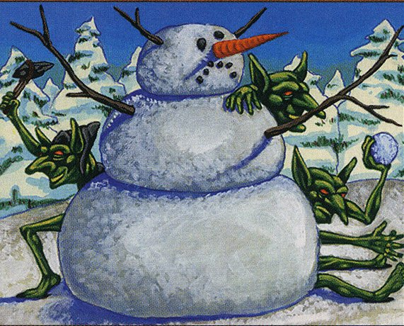

## 012: Reviewing EVERY red 4-mana 1/1 in Magic: the Gathering

You read that right. Today, Austin and Connor discuss and rate [every red, four-mana 1/1 creature](https://scryfall.com/search?q=mv%3D4+t%3Dcreature+c%3Dr+pow%3D1+tou%3D1+-border%3Asilver+is%3Afirstprinting) in the game of Magic. Now that we've finished our review of Champions of Kamigawa (you can catch our previous episode on lands [here](https://clockspinning.com/episode-11-lands-review/)), we wanted to try something a bit different, and we had a lot of fun with this one. In this episode, you'll encounter cards from across Magic's long history, hear about the [second-most popular counters](https://twitter.com/maro254/status/780387010863177728), gaze upon some of the game's [bulging-est bois](https://scryfall.com/card/ody/228/whipkeeper), and hopefully learn something new about some very strange creatures! We certainly did.

This is usually where we introduce our IMPAB rating system. But because today's cards aren't going into our [Kamigawa Block Cube](https://cubecobra.com/cube/overview/clock-spinning-chk) over on Cube Cobra, we won't be using IMPAB. What rating system are we using? Tune in to find out!

In our next episode, we're hoping to share some of the experiences and insights we've had from playtesting the CHK cube. We would also really love for you to [take the cube for a test drive](https://cubecobra.com/cube/playtest/clock-spinning-chk). If you do, let us know what you think!

As always, if you have any thoughts on today's episode, the cube, or the show more generally, you can reach us by email at clock.spinning.podcast@gmail..com, or comment on any of [/u/ClockSpinning's posts](https://www.reddit.com/user/ClockSpinning) over on Reddit.

## Featured on today's episode

* Akki Lavarunner // Tok-Tok, Volcano-Born - 03:44
* Akki Underminer - 09:18
* Aladdin - 12:30
* Amplifire - 19:47
* Ben-Ben, Akki Hermit - 23:11
* Bomb Squad - 27:21
* Cinder Seer - 33:53
* Diaochan, Artful Beauty - 38:43
* Embermage Goblin - 46:20
* Fallen Ferromancer - 52:57
* Firefly - 55:45
* Goblin Fire Fiend - 58:23
* Goblin Settler - 1:01:17
* Goblin Snowman - 1:05:22
* Goblin Wizard - 1:09:26
* Marton Stromgald - 1:12:50
* Mine Layer - 1:17:44
* Minotaur Tactician - 1:23:17
* Nalathni Dragon - 1:28:51
* Quarum Trench Gnomes - 1:34:01
* Rabble Rouser - 1:40:21
* Scampering Scorcher - 1:42:21
* Seismic Mage - 1:46:28
* Whipkeeper - 1:52:14
* Ratings Recap - 1:56:19

_Image credit: Goblin Snowman by Daniel Gelon, © Wizards of the Coast_