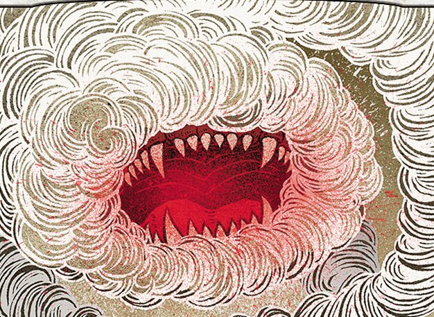

Today on Clock Spinning, we're starting up our second set review series with Betrayers of Kamigawa. Join us on this [day of destiny](https://scryfall.com/card/bok/1/day-of-destiny) as we rate and review the first 15 white cards in Betrayers for cube. We'll see [epic sorceries that should be arcane](https://scryfall.com/card/bok/4/final-judgment), kami galore, and [more](https://scryfall.com/card/bok/3/faithful-squire-kaiso-memory-of-loyalty) [damage](https://scryfall.com/card/bok/6/heart-of-light) [prevention](https://scryfall.com/card/bok/15/mending-hands) than you can shake a stick at!

As always, we'll be using our IMPAB rating system to rate cards. IMPAB stands for:

 - Insta-cut
 - Meh
 - Playable
 - Auto-include
 - Build-around

If you're just joining us, you might want to check out [Episode 1](https://clockspinning.com/episode-1-white-champions-of-kamigawa/), where we do a deeper dive into the history of Kamigawa block and review all 50 white cards in Champions of Kamigawa. But if you'd rather jump straight into the Betrayers action, you're in the right place.

Be sure to take a look at our evolving [Kamigawa Block Cube](https://cubecobra.com/cube/overview/clock-spinning-chk) over on Cube Cobra, which is updated with our card ratings and cuts after each episode. We'd love it if you'd try [playtesting](https://cubecobra.com/cube/playtest/clock-spinning-chk) the cube as well.

Stay tuned for White Part 2, and of course the sequel to our [7+ mana enchantments episode](https://clockspinning.com/episode-13-seven-mana-enchantments-part-1/), which we're looking forward to bringing to you soon!

As always, we'd love to hear from you if you have any thoughts or memories you'd like to share. You can email us at clockspinningpodcast@gmail.com, or find us over on the [MagicTCG](https://www.reddit.com/r/magicTCG/), [MTGCube](https://www.reddit.com/r/mtgcube/), and [EDH](https://www.reddit.com/r/EDH/) subreddits.

### Today's cards

* Overview of the cube - 04:48
* IMPAB rating system - 05:42
* Day of Destiny - 09:53
* Empty-Shrine Kanushi - 14:22
* Faithful Squire - 18:16
* Final Judgment - 25:46
* Genju of the Fields - 31:59
* Heart of Light - 39:44
* Hokori, Dust Drinker - 43:11
* Hundred-Talon Strike - 49:58
* Indebted Samurai - 54:39
* Kami of False Hope - 58:10
* Kami of Tattered Shoji - 1:01:20
* Kami of the Honored Dead - 1:03:08
* Kentaro, Smiling Cat - 1:06:41
* Kitsune Palliator - 1:11:39
* Mending Hands - 1:15:06
* Outro - 1:19:58

_Image credit: Hokori, Dust-Drinker by Yuko Shimizu, © Wizards of the Coast_