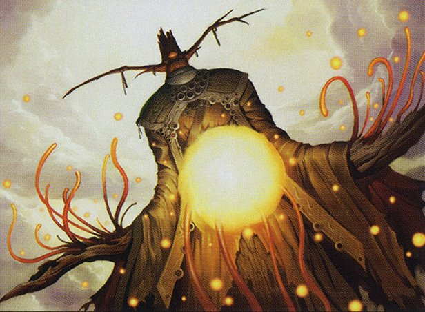

In this week's episode of Clock Spinning, we're finishing up our review of the white cards of Betrayers of Kamigawa, looking at cards from [Moonlit Strider](https://scryfall.com/card/bok/16/moonlit-strider) to the epically named [Yomiji, Who Bars the way](https://scryfall.com/card/bok/30/yomiji-who-bars-the-way). Today's batch of cards includes Magic's very first keyworded [defender](https://scryfall.com/card/bok/17/opal-eye-kondas-yojimbo) (ever!), even more [cycles](https://scryfall.com/card/bok/21/shining-shoal), and one of the most [baffingly weak cards](https://scryfall.com/card/bok/24/takenos-cavalry) we've ever rated.

If you're just joining us, you'll hear us use our "IMPAB" rating system to rate cards. IMPAB stands for:

 - Insta-cut
 - Meh
 - Playable
 - Auto-include
 - Build-around

Our first Betrayers episode, which you can find [here](https://clockspinning.com/episode-14-bok-white-1/), introduces IMPAB in a bit more detail, along with some other fun facts about the set.

You can also watch our [Kamigawa Block Cube](https://cubecobra.com/cube/overview/clock-spinning-chk) as it takes shape over on Cube Cobra. We update the cube list with our ratings and cuts after each episode, and we'd love it if you try taking it for a [test draft](https://cubecobra.com/cube/playtest/clock-spinning-chk)! If you give it a try, let us know what you think!

We love to hear from listeners with their thoughts on the cube, the cards in it, or anything else Magic-related (but especially about strange old cards like these). You can get in touch with us at clock[dot]spinning[dot]podcast[at]gmail[dot].com, or find us over on the [MagicTCG](https://www.reddit.com/r/magicTCG/), [MTGCube](https://www.reddit.com/r/mtgcube/), and [EDH](https://www.reddit.com/r/EDH/) subreddits.

### Today's cards

* Moonlit Strider - 01:28
* Opal-Eye, Konda's Yojimbo - 03:51
* Oyobi, Who Split the Heavens - 11:12
* Patron of the Kitsune - 15:32
* Scour - 21:22
* Shining Shoal - 23:18
* Silverstorm Samurai - 30:14
* Split-Tail Miko - 31:34
* Takeno's Cavalry - 33:18
* Tallowisp - 36:22
* Terashi's Grasp - 39:03
* Terashi's Verdict - 43:58
* Ward of Piety - 47:49
* Waxmane Baku - 49:14
* Yomiji, Who Bars the Way - 52:35
* Outro - 57:33

_Image credit: Yomiji, Who Bars the Way by Hideaki Takamura, © Wizards of the Coast_