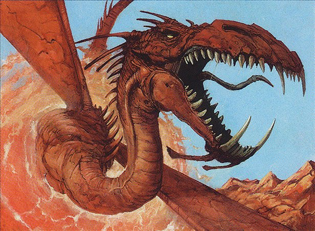

We promised a Part Two to our [7 or mana enchantments episode](https://clockspinning.com/episode-13-seven-mana-enchantments-part-1/), and today, we deliver!

In Part One, we covered every white and blue enchantment in the game that costs 7 or more mana. Today, we're finishing our comprehensive review of these heavyweight cards by looking at [every other color in the pie](https://scryfall.com/search?q=mv%3E%3D7+t%3Denchantment+-t%3Dcreature+-is%3Afunny+-%28c%3DU+OR+c%3Dw%29+is%3Afirstprinting+order%3Acolor), plus a beloved colorless bonus. (That is, if you're willing to [pay the price](https://scryfall.com/card/c13/89/price-of-knowledge) and [stick with us](https://scryfall.com/card/rna/160/captive-audience) through the whole episode!)

As usual for our more thematic (read: not Kamigawa) episodes, we're setting aside our time-honored IMPAB rating method in favor of an Internet favorite: the [tier list](https://www.reddit.com/r/heroes3/comments/glz2m2/tier_list_of_level_1_units_in_heroes_3_sod_based/).

If you're just tuning in to Clock Spinning, we'd encourage you to check out our OG Kamigawa set review series, where we rate every single card in Champions with an eye toward building a cube.

And if you'd like to share thoughts or memories of any of these cards, or if you immediately recognized the images in [that tier list](https://www.reddit.com/r/heroes3/comments/glz2m2/tier_list_of_level_1_units_in_heroes_3_sod_based/), let us know! We'd love to hear from you.

You can find every episode [on YouTube](https://www.youtube.com/@clockspinning) (leave a comment!), email us at clockspinningpodcast@gmail.com, or find us over on the [MagicTCG](https://www.reddit.com/r/magicTCG/), [MTGCube](https://www.reddit.com/r/mtgcube/), and [EDH](https://www.reddit.com/r/EDH/) subreddits.

### Today's cards

* Baneful Omen - 1:27
* Cruel Reality - 6:46
* Grave Betrayal - 12:37
* Hedonist's Trove - 16:27
* Price of Knowledge - 21:28
* Form of the Dragon - 25:45
* Vicious Shadows - 32:11
* Colossification - 37:13
* Mythic Proportions - 40:42
* Sandwurm Convergence - 42:19
* Spawning Grounds - 46:41
* The World Spell - 51:57
* Zendikar Resurgent - 57:20
* Captive Audience - 1:01:59
* Debtor's Knell - 1:07:19
* Cloven Casting - 1:12:25
* Yavimaya's Embrace - 1:15:57
* Eldrazi Conscription - 1:20:37

_Image credit: Form of the Dragon by Kev Walker, © Wizards of the Coast_