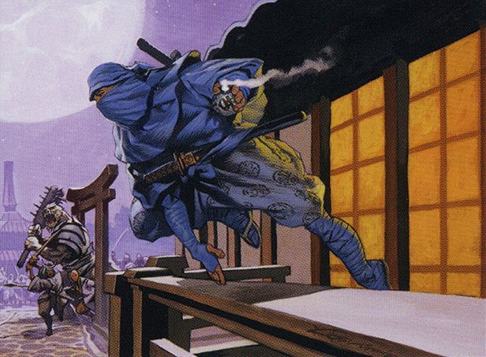

Clock Spinning continues its journey through Betrayers of Kamigawa by venturing into Blue! If you're like us (and if you're reading this, you probably are), when you hear "Kamigawa" you think "ninjas." Well today, we're very excited to present (and rate, and review) a few of those much-loved silent killers, including a [legendary ninja tutor-er](https://scryfall.com/card/bok/37/higure-the-still-wind) (tutorist?) and a [legendary-in-fame-only thief](https://scryfall.com/card/bok/44/ninja-of-the-deep-hours). Along the way, we'll encounter some of Kamigawa's obligatory [freaky spirits](https://scryfall.com/card/bok/32/chisei-heart-of-oceans), along with one card whose power level you'd do well to [heed](https://scryfall.com/card/bok/36/heed-the-mists).

By now you're probably familiar with our IMPAB rating system, which we use for every Kamigawa card we cover on the show. But in case you're just joining us, IMPAB stands for:

 - Insta-cut
 - Meh
 - Playable
 - Auto-include
 - Build-around

And if this is your first encounter with Clock Spinning, welcome! As we rate and review these weird and wonderful cards from days of Magic past, our goal is to build a cube that captures the unique spirit (see what we did there?) of the original Kamigawa block.

You can find our first foray into Kamigawa [here](https://clockspinning.com/episode-1-white-champions-of-kamigawa/), where we get into more detail on what made Kamigawa such a unique block and explain our rating system and the philosophy behind the cube we're building. You can also check out our evolving [Kamigawa Block Cube](https://cubecobra.com/cube/overview/clock-spinning-chk) over on Cube Cobra, which is updated with our card ratings and cuts after each episode. You can even try [playtesting](https://cubecobra.com/cube/playtest/clock-spinning-chk) the cube as well!

While our adventures through Betrayers of Kamigawa will certainly continue, we also have some ideas for more thematically-oriented episodes (like our [7+ mana enchantments mini-series](https://clockspinning.com/episode-13-seven-mana-enchantments-part-1/)) that we're pretty excited about, so stay tuned.

If you have any memories or stories to share about any of the cards we discuss on the show, please get in touch! You can email us at clockspinningpodcast@gmail.com, or find us over on the [MagicTCG](https://www.reddit.com/r/magicTCG/), [MTGCube](https://www.reddit.com/r/mtgcube/), and [EDH](https://www.reddit.com/r/EDH/) subreddits. We also upload every episode to [our YouTube channel](https://www.youtube.com/@clockspinning), where you can see the image for each card as we talk about them.

### Today's cards

* Callow Jushi - 02:02
* Chisei, Heart of Oceans - 07:45
* Disrupting Shoal - 15:14
* Floodbringer - 19:39
* Genju of the Falls - 25:20
* Heed the Mists - 30:08
* Higure, the Still Wind - 34:48
* Jetting Glasskite - 43:27
* Kaijin of the Vanishing Touch - 49:28
* Kira, the Great Glass-Spinner - 55:03
* Minamo Sightbender - 1:01:58
* Minamo's Meddling - 1:06:21
* Mistblade Shinobi - 1:09:31
* Ninja of the Deep Hours - 1:14:04
* Patron of the Moon - 1:17:19

_Image credit: Higure, the Still Wind by Christopher Moeller, © Wizards of the Coast_