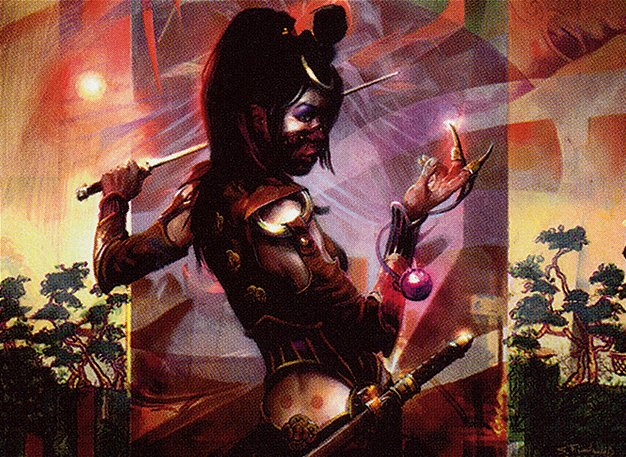

In this episode of Clock Spinning, we're wrapping up our review of the blue cards of Betrayers of Kamigawa. Today's episode features [Tomorrow](https://scryfall.com/card/bok/58/tomorrow-azamis-familiar), more [confusingly non-Arcane cards](https://scryfall.com/card/bok/49/reduce-to-dreams) that might have become reprints in another life, and [a card](https://scryfall.com/card/bok/53/stream-of-consciousness) or [two](https://scryfall.com/card/bok/57/toils-of-night-and-day) that appear to do essentially nothing, at least in this podcast's cube.

As usual, we'll rely on our faithful IMPAB rating system. If this is the first episode of Clock Spinning you've tuned in to, IMPAB stands for:

 - Insta-cut
 - Meh
 - Playable
 - Auto-include
 - Build-around

As we rate and review these weird and wonderful cards from days of Magic past, our goal is to build a cube that captures the unique spirit (see what we did there?) of the original Kamigawa block.

You can find our very first episode, and our first card-by-card deep dive into Kamigawa, [here](https://clockspinning.com/episode-1-white-champions-of-kamigawa/), where we also explain our IMPAB rating system and cube we're rating all these cards for. You can find that cube over on [Cube Cobra](https://cubecobra.com/cube/overview/clock-spinning-chk). We update the list after each and every episode of the show. We would also love for you to try [playtesting](https://cubecobra.com/cube/playtest/clock-spinning-chk) the cube, which gives us more insight into what works and what doesn't (and hopefully is a bit of fun for you too!).

If you have any thoughts to share about the cards we discuss on the show, cube philosophy, or just Magic in general, please get in touch! You can email us at clock[dot]spinning[dot]podcast[at]gmail[dot].com, or find us over on the [MagicTCG](https://www.reddit.com/r/magicTCG/), [MTGCube](https://www.reddit.com/r/mtgcube/), and [EDH](https://www.reddit.com/r/EDH/) subreddits. We also upload every episode to [our YouTube channel](https://www.youtube.com/@clockspinning), where we put up a nice image of every card as we discuss it.

### Today's cards

* Phantom Wings - 2:17
* Quash - 8:34
* Quillmane Baku - 13:28
* Reduce to Dreams - 19:18
* Ribbons of the Reikai  - 23:44
* Shimmering Glasskite - 30:16
* Soratami Mindsweeper - 36:21
* Stream of Consciousness - 38:55
* Sway of the Stars - 43:36
* Teardrop Kami - 46:57
* Threads of Disloyalty - 53:31
* Toils of Night and Day - 1:01:01
* Tomorrow, Azami's Familiar - 1:03:46
* Veil of Secrecy - 1:11:11
* Walker of Secret Ways - 1:17:28

_Image credit: Walker of Secret Ways by Scott M. Fischer, © Wizards of the Coast_
