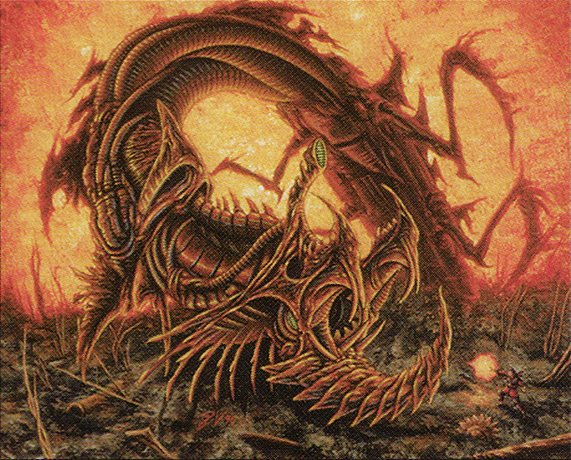

We have a very special episode of Clock Spinning in store! To celebrate the release of the latest Praetors, planeswalkers, and poison counters in Phyrexia: All Will Be One, we've decided to go way back in Magic's history for a look at the game's **oldest** denizens of the Machine Hell. Join us as we pry open the [Gate to Phyrexia](https://scryfall.com/card/me4/82/gate-to-phyrexia) and discover the [Gremlins](https://scryfall.com/card/atq/18/phyrexian-gremlins), [Demons](https://scryfall.com/card/atq/21/yawgmoth-demon), and [Dreadnoughts](https://scryfall.com/card/mir/315/phyrexian-dreadnought) that started it all.

Today's episode uses the tried-and-true tier list method of rating: S tier cards are the all-time greats (and maybe a few cards we love for completely arbitrary reasons), down through A-B-C-D-E, and then of course F tier cards which... speak for themselves.

If this is your first time listening to the show, thanks for tuning in! We're a podcast about the history of Magic. When we're not looking at old Phyrexians or [building Goblin Snowmen](https://clockspinning.com/episode-12-four-mana-red-1-1s/), you can find us rating and reviewing our way through every card in the original Kamigawa block with an eye toward building a cube. That saga starts [with our Champions of Kamigawa White Review](https://clockspinning.com/episode-1-white-champions-of-kamigawa/), where we also explain how we rate cards and give an overview of the cube we're building.

Have you ever [Illusionary Mask-ed out a Phyrexian Dreadnought](https://scryfall.com/search?q=%22illusionary+mask%22+OR+%22phyrexian+dreadnought%22&unique=cards&as=grid&order=name) on turn 1 or made a [Gallowbraid](https://scryfall.com/search?q=%22gallowbraid%22+OR+%22morinfen%22&unique=cards&as=grid&order=name) Commander deck? We'd love to get in touch. You can email us at clockspinningpodcast@gmail.com, or find us over on the [/r/MagicTCG](https://www.reddit.com/r/magicTCG/), [/r/MTGCube](https://www.reddit.com/r/mtgcube/), and [/r/EDH](https://www.reddit.com/r/EDH/) subreddits. We also upload every episode to [our @clockspinning YouTube channel](https://www.youtube.com/@clockspinning), where we put up a [lovely image](https://scryfall.com/card/all/58a/phyrexian-boon) of every card as we discuss it.

### Today's cards

* Gate to Phyrexia - 02:24
* Phyrexian Gremlins - 13:08
* Priest of Yawgmoth - 20:37
* Yawgmoth Demon - 30:10
* Phyrexian Boon - 39:44
* Phyrexian Devourer - 44:51
* Phyrexian Portal - 52:17
* Phyrexian War Beast - 58:27
* Phyrexian Tribute - 1:02:39
* Phyrexian Purge - 1:05:32
* Phyrexian Dreadnought - 1:11:10
* Phyrexian Vault - 1:20:08
* Phyrexian Marauder - 1:25:44
* Phyrexian Walker - 1:31:13
* Gallowbraid - 1:34:18
* Morinfen - 1:35:04
* Phyrexian Furnace - 1:42:47

_Image credit: Phyrexian Dreadnought by Pete Venters, © Wizards of the Coast_
