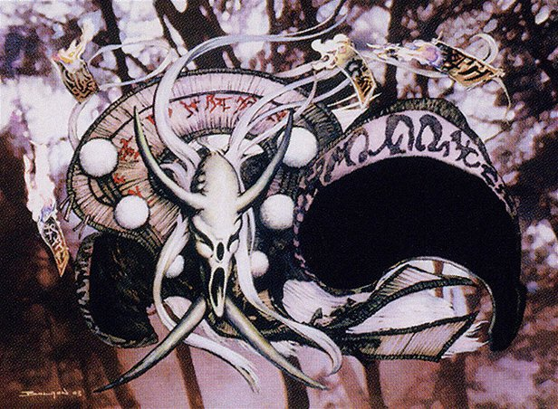

In this week's episode of Clock Spinning, we're rating and reviewing the first 25 black cards (alphabetically speaking) in Champions of Kamigawa. Listen in as we explore some of the set's most gruesome art, rate some of its most solid cards, and debate just how much fear we want to have in the cube. And for the true data obsessives, [check out our Kiku spreadsheet](https://docs.google.com/spreadsheets/d/1jyQg8sIezcvWJH5Lwyt014f8ODBm5IGrZItoRcndRmw/edit#gid=1592853001) to see which Kamigawa block creatures succumb to Kiku’s wiles.

There's just so much to discuss, so we've decided to try recording two episodes for each color. This format will also help us release episodes regularly and keep the [Flow of Ideas](https://scryfall.com/card/rav/50/flow-of-ideas) coming!

Be sure to check out our [Kamigawa Block Cube](https://cubecobra.com/cube/overview/clock-spinning-chk) over on Cube Cobra, which we've updated with our ratings (and cuts) from today's episode. You can always [try drafting the cube for yourself](https://cubecobra.com/cube/playtest/clock-spinning-chk) if you're interested!

On our next episode, we'll be finishing up with black. If you have any thoughts you'd like to share on the black cards of Kamigawa, or on red or green, shoot us an email at clock [dot] spinning [dot] podcast [at] gmail [dot] com.

## Today's reviews and timestamps

- Ashen-Skin Zubera (barely!) - 2:03
- Befoul - 2:58
- Blood Speaker - 8:16
- Bloodthirsty Ogre - 12:59
- Cranial Extraction - 17:26
- Cruel Deceiver - 21:38
- Cursed Ronin - 26:27:00
- Dance of Shadows - 30:27:00
- Deathcurse Ogre - 35:19:00
- Devouring Greed - 38:15:00
- Distress - 42:34:00
- Gibbering Kami - 48:03:00
- Gutwrencher Oni - 49:49:00
- He Who Hungers - 54:32:00
- Hideous Laughter - 59:15:00
- Honden of Night's Reach - 1:02:56
- Horobi, Death's Wail - 1:08:10
- Iname, Death Aspect - 1:14:26
- Kami of Lunacy - 1:18:43
- Kami of the Waning Moon - 1:21:34
- Kiku, Night's Flower - 1:24:05
- Kokusho, the Evening Star - 1:31:19
- Kuro, Pitlord - 1:35:29
- Marrow-Gnawer - 1:41:49
- Midnight Covenant - 1:46:24
- Outro - 1:50:35

_Art credit: Horobi, Death's Wail by John Bolton, © Wizards of the Coast_