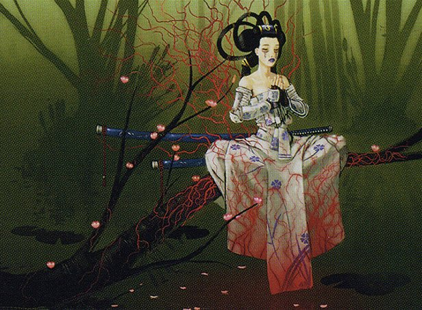

Clock Spinning is back in black! In this week's episode, we're rating and reviewing the back half of black in Champions of Kamigawa, ranging from [Myojin of Night's Reach](https://scryfall.com/card/chk/126/myojin-of-nights-reach) all the way through to the oh-so-[Wicked Akuba](https://scryfall.com/card/chk/150/wicked-akuba). Buckle up for thrills, chills, and even more revolting art (and maybe a gross story or two)!

If you'd like to follow along as we build the cube, check out our [Kamigawa Block Cube](https://cubecobra.com/cube/overview/clock-spinning-chk) over on Cube Cobra, which we update with card ratings (and cuts) after each episode. You can always [try drafting the cube for yourself](https://cubecobra.com/cube/playtest/clock-spinning-chk) if you're interested!

On our next episode, we're hiking up into the Sokenzan Mountains to see just how weak this set can get. (Spoiler: Red is [pretty bad](https://scryfall.com/card/chk/157/ben-ben-akki-hermit)) If you have some thoughts, insights, or memories to share with us about the red cards of Kamigawa, or any other cards in the block, send us an email at clock [dot] spinning [dot] podcast [at] gmail [dot] com.

## Today's reviews and timestamps

- Myojin of Night's Reach - 2:12
- Nezumi Bone-Reader - 7:25
- Nezumi Cutthroat - 10:23
- Nezumi Graverobber - 13:47
- Nezumi Ronin - 18:26
- Nezmui Shortfang // Stabwhisker the Odious - 21:44
- Night Dealings - 27:24
- Night of Souls' Betrayal - 33:14
- Numai Outcast - 39:19
- Oni Possession - 41:54
- Painwracker Oni - 47:10
- Pull Under - 50:15
- Rag Dealer - 54:57
- Ragged Veins - 57:24
- Rend Flesh - 1:01:59
- Rend Spirit - 1:07:27
- Scuttling Death - 1:10:02
- Seizan, Perverter of Truth - 1:13:27
- Soulless Revival - 1:20:01
- Struggle for Sanity - 1:26:56
- Swallowing Plague - 1:29:09
- Thief of Hope - 1:32:33
- Villainous Ogre - 1:35:49
- Waking Nightmare - 1:39:52
- Wicked Akuba - 1:40:42

_Image credit: Ragged Veins by Chippy, © Wizards of the Coast_