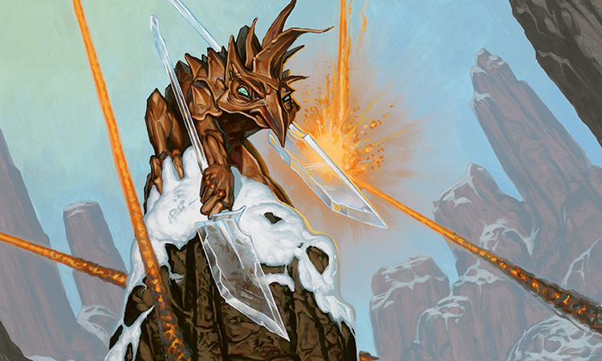

This week on Clock Spinning, we're closing out our two-part review of every red card in Champions of Kamigawa, from the [mightiest yamabushi](https://scryfall.com/card/chk/176/kumano-master-yamabushi) to [Zo-Zu the Punisher](https://scryfall.com/card/chk/200/zo-zu-the-punisher), our one and only Akki in today's episode. Join us as we explore the best--and the worst--red has to offer in Champions.

Please check out our [Kamigawa Block Cube](https://cubecobra.com/cube/overview/clock-spinning-chk) over on Cube Cobra, and take it out for a [playtest]((https://cubecobra.com/cube/playtest/clock-spinning-chk) if you want a hands-on experience with Clock Spinning. As always, we've updated the cube with all of this episode's IMPAB ratings and cuts.

Next week, we'll be searching the forests of Kamigawa for snakes, spirits, and [beefy monks](https://scryfall.com/card/chk/214/humble-budoka), and we'd love to hear from you. If there are any green cards in Champions that hold a special place in your heart, let us know! You can reach us by email at clock[dot]spinning[dot]podcast[at]gmail[dot].com, or comment on our posts over at the [MagicTCG](https://www.reddit.com/r/magicTCG/) and [MTGCube](https://www.reddit.com/r/mtgcube/) subreddits.

If you know someone who might enjoy the show, please let them know about us! We'd love to reach more fans of Kamigawa, cube, and just chatting about Magic cards.

## Today's reviews and timestamps

+ Kumano, Master Yamabushi - 2:38
+ Kumano's Pupils - 7:59
+ Lava Spike - 10:16
+ Mana Seism - 15:31
+ Mindblaze - 19:04
+ Myojin of Infinite Rage - 24:26
+ Ore Gorger - 31:09
+ Pain Kami - 34:52
+ Ronin Houndmaster - 38:15
+ Ryusei, the Falling Star - 41:08
+ Shimatsu the Bloodcloaked - 46:25
+ Sideswipe - 52:15
+ Sokenzan Bruiser - 58:29
+ Soul of Magma - 1:02:44
+ Soulblast - 1:05:24
+ Stone Rain - 1:10:19
+ Strange Inversion - 1:18:51
+ Through the Breach - 1:22:30
+ Tide of War - 1:28:41
+ Uncontrollable Anger - 1:32:27
+ Unearthly Blizzard - 1:37:00
+ Unnatural Speed - 1:39:26
+ Yamabushi's Flame - 1:45:22
+ Yamabushi's Storm - 1:49:10
+ Zo-Zu the Punisher - 1:53:46

_Image credit: Zo-Zu the Punisher by Matt Cavotta, © Wizards of the Coast_