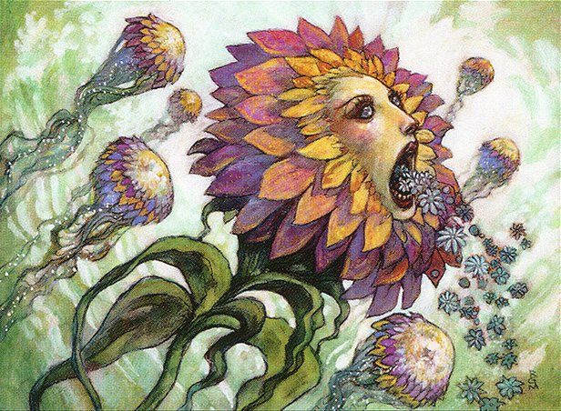

In today's episode of Clock Spinning, Austin and Connor delve into the Jukai Forest in Part 1 of a two-part review of every green card in Champions of Kamigawa. Our journey today begins and ends with iconic cards, stretching from [Azusa, Lost but Seeking](https://scryfall.com/card/chk/201/azusa-lost-but-seeking) to the EDH staple [Kodama's Reach](https://scryfall.com/card/chk/225/kodamas-reach). Be prepared to encounter [many monks](https://scryfall.com/search?as=grid&order=name&q=type%3Amonk+color%3DG+set%3Achk), a cascade of Kodama cards, and the final members of some of our [favorite](https://scryfall.com/card/chk/213/honden-of-lifes-web) (and [least-favorite](https://scryfall.com/card/chk/208/feral-deceiver)) cycles in Champions! As always, our ultimate goal is to build a cube that highlights the fun, feel, and even flavor of Kamigawa block.

Be sure to take a look at our [Kamigawa Block Cube](https://cubecobra.com/cube/overview/clock-spinning-chk) over on Cube Cobra, and try [playtesting it](https://cubecobra.com/cube/playtest/clock-spinning-chk) if you want a more hands-on experience with Clock Spinning. We update the cube with our IMPAB ratings and cuts after each episode.

In our next episode, we'll be finishing up with green, which means we're almost done with Champions! If you have any parting thoughts or stories to share with us about any of the cards we'll discuss next time, we would love to hear them! Here's a handy spoiler showing [next episode's cards](https://scryfall.com/search?q=e%3Dchk+c%3Dg+cn%3E%3D226&unique=cards&as=grid&order=name). You can reach us by email at clock[dot]spinning[dot]podcast[at]gmail[dot].com, or find us over on the [MagicTCG](https://www.reddit.com/r/magicTCG/) and [MTGCube](https://www.reddit.com/r/mtgcube/) subreddits.

If you know someone who might enjoy the show, please let them know about us! We'd love to reach more fans of Kamigawa, cube, and just chatting about Magic cards.

## Featured on Today's Episode

- Azusa, Lost but Seeking - 2:33
- Budoka Gardener // Dokai, Weaver of Life - 11:33
- Burr Grafter - 16:43
- Commune with Nature - 23:08
- Dosan the Falling Leaf - 33:18
- Dripping-Tongue Zubera - 37:16
- Feast of Worms - 39:15
- Feral Deceiver - 43:40
- Gale Force - 49:40
- Glimpse of Nature - 56:52
- Hana Kami - 1:02:15
- Heartbeat of Spring - 1:07:32
- Honden of Life's Web - 1:11:06
- Humble Budoka - 1:18:55
- Iname, Life Aspect - 1:23:08
- Joyous Respite - 1:28:52
- Jugan, the Rising Star - 1:33:45
- Jukai Messenger - 1:36:39
- Kami of the Hunt - 1:40:49
- Kashi-Tribe Reaver - 1:44:01
- Kashi-Tribe Warriors - 1:51:15
- Kodama of the North Tree - 1:53:32
- Kodama of the South Tree - 1:57:39
- Kodama's Might - 2:03:36
- Kodama's Reach - 2:07:06

_Image credit: Hana Kami by Rebecca Guay, © Wizards of the Coast_